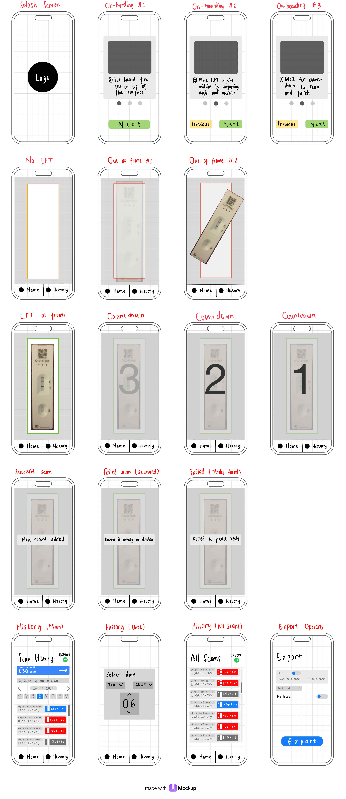

# Ordinary App

Very much extra super ordinary mobile application

## Low Fidelity Mockup

Low-fidelity prototype image as a sequence of screens for the mobile application, detailing the user journey through various steps of the app's functionality. Here's a description of each screen:

1.  **Splash Screen**: A simple screen with a logo in the center, serving as the initial loading screen for the app.
2.  **On-boarding #1**: Instructions for the user to place a lateral flow test (LFT) on a flat surface, with a "Next" button.
3.  **On-boarding #2**: Further instructions to position the LFT correctly, with "Previous" and "Next" navigation buttons.
4.  **On-boarding #3**: A prompt for the user to wait for a countdown to scan the LFT, with navigation buttons.
5.  **No LFT**: The main screen (landing) indicating that no test is present, with "Home" and "History" options.
6.  **Out of Frame #1**: A screen showing an incorrectly placed LFT that is out of frame.
7.  **Out of Frame #2**: Another example of an out-of-frame LFT, this time angled and partially out of view.
8.  **LFT in Frame**: The correct placement of an LFT within the frame for scanning.
9.  **Countdown**: A sequence of screens showing a countdown from 3 to 1, before the app scans the LFT.
10. **Successful Scan**: A confirmation screen stating "New record added" after a successful scan.
11. **Failed Scan (Scanned)**: An error screen indicating the record is already in the database.
12. **Failed (Model Failed)**: An error screen stating "Failed to predict result," suggesting the app couldn't interpret the LFT result.
13. **History (Main)**: A screen showing the history of scans, with an "Export" feature and a search bar, along with a detailed list of previous scan results.
14. **History (Date)**: This screen allow the user to select a date and view the history of scans for that particular day.
15. **History (All Scans)**: Displays all scan results with the option to "Export" the data. The scans are labeled with outcomes like "Positive," "Negative," or "Invalid."
16. **Export Options**: A screen dedicated to exporting data, with filters for date range and result type, along with a toggle for including invalid results.

## Use this README File

Use this section to show us what your Mobile App is about. Include a Screenshot to the App, link to the various frameworks you've used. Include your presentation video here that shows off your Mobile App. Emojis are also fun to include 📱 😄

Look at some other Flutter Apps online and see how they use there README File. Good examples are:

- https://github.com/miickel/flutter_particle_clock
- https://github.com/Tarikul711/flutter-food-delivery-app-ui
- https://github.com/mohak1283/Instagram-Clone

## Include A Section That Tells Developers How To Install The App

Include a section that gives intructions on how to install the app or run it in Flutter. What versions of the plugins are you assuming? Maybe define a licence

## Contact Details

Having Contact Details is also good as it shows people how to get in contact with you if they'd like to contribute to the app.
