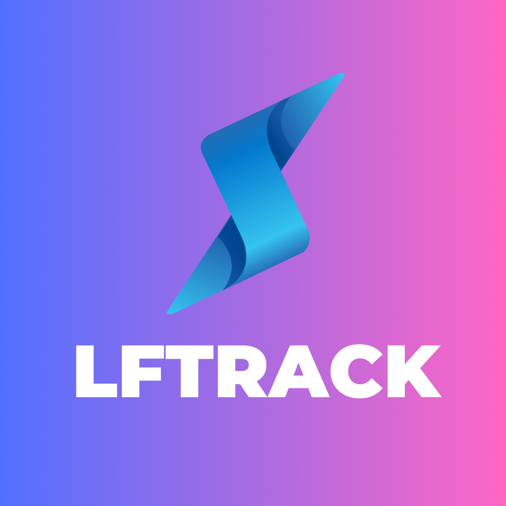
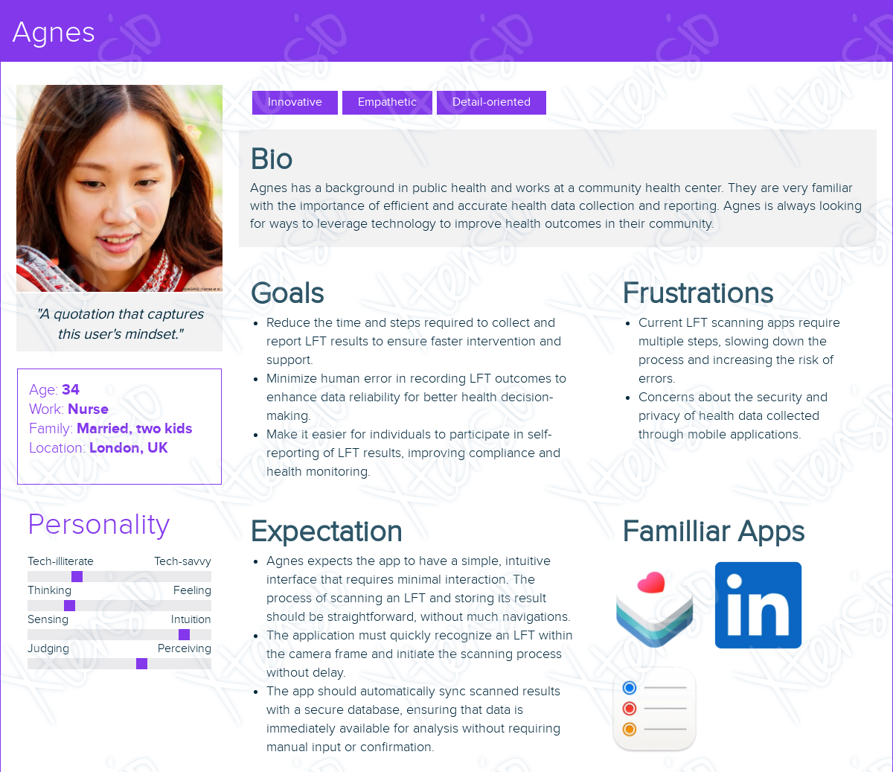

<div style="text-align: center;">
    <a href="https://adityojulian.github.io/lftrack/">
        
    </a>
    <p align="center" style="font-size: 26px; font-weight: bold;">LFTrack: Instant, Accurate, and Secure LFT Results at Your Fingertips</p>
</div>
<hr>
<p align="center" style="font-size: 24px; font-weight: bold;">Also visit <a href="https://adityojulian.github.io/lftrack/">LFTrack microsite</a> for more info!</p>

## Project Description

This [Flutter](https://flutter.dev/)-based cross-platforms mobile application is designed to streamline the way Lateral Flow Tests (LFTs) are processed and managed by forcing as minimum user interaction as possible while maintaining user-friendly interface and intuitiveness. The app, through integrated light model ([TFLite](https://www.tensorflow.org/lite)) and data management technologies, enables users to scan LFTs using their smartphone cameras, automatically interpret the results, and seamlessly store these results in a secure database.

From the moment the LFT is positioned within the camera's frame, the app initiates a countdown, performs the scan, interprets the result, and stores it—all without unnecessary steps or inputs from the user.

## Key-Features

**:star2: Automatic Detection and Scanning:** Utilizes the smartphone camera to detect LFTs and automatically starts the scanning process.

**:zap: Instant Result Interpretation:** Employs integrated light-weight TFLite model to interpret test results accurately within seconds.

**:fire: Direct Database Integration:** Automatically uploads results to a secure [Firebase](https://firebase.google.com/) database, ensuring data integrity and privacy.

**:iphone: User-friendly Interface:** Designed for ease of use, requiring minimal interaction from the user to complete the scanning process.

## Screens

<table>
  <tr>
    <!-- Image 1 -->
    <td>
      <p align="center" style="font-size: 16px; font-weight: bold;">Instant scan with minimum interaction</p>
      
      <br>
    </td>
    <!-- Image 2 -->
    <td>
      <p align="center" style="font-size: 16px; font-weight: bold;">Notification dialog for scan errors</p>
      
      <br>
    </td>
    <!-- Image 3 -->
    <td>
      <p align="center" style="font-size: 16px; font-weight: bold;">Search scanned LFT based on label and ID</p>
      
      <br>
    </td>
  </tr>
</table>

<table>
  <tr>
    <!-- Image 1 -->
    <td>
      <p align="center" style="font-size: 16px; font-weight: bold;">Filter based on date or date range</p>
      
      <br>
    </td>
    <!-- Image 2 -->
    <td>
      <p align="center" style="font-size: 16px; font-weight: bold;">Convert LFT results to CSV</p>
      
      <br>
    </td>
    <!-- Image 3 -->
    <td>
      <p align="center" style="font-size: 16px; font-weight: bold;">Switch to Darkmode for better readability</p>
      
      <br>
    </td>
  </tr>
</table>

## User Persona

This user persona is designed using [Xtensio](https://xtensio.com/).



## Low Fidelity Mockup

Low-fidelity prototype image as a sequence of screens for the mobile application, detailing the user journey through various steps of the app's functionality.


Here's a description of each screen:

1.  **Splash Screen**: A simple screen with a logo in the center, serving as the initial loading screen for the app.
2.  **On-boarding #1**: Instructions for the user to place a lateral flow test (LFT) on a flat surface, with a "Next" button.
3.  **On-boarding #2**: Further instructions to position the LFT correctly, with "Previous" and "Next" navigation buttons.
4.  **On-boarding #3**: A prompt for the user to wait for a countdown to scan the LFT, with navigation buttons.
5.  **No LFT**: The main screen (landing) indicating that no test is present, with "Home" and "History" options.
6.  **Out of Frame #1**: A screen showing an incorrectly placed LFT that is out of frame.
7.  **Out of Frame #2**: Another example of an out-of-frame LFT, this time angled and partially out of view.
8.  **LFT in Frame**: The correct placement of an LFT within the frame for scanning.
9.  **Countdown**: A sequence of screens showing a countdown from 3 to 1, before the app scans the LFT.
10. **Successful Scan**: A confirmation screen stating "New record added" after a successful scan.
11. **Failed Scan (Scanned)**: An error screen indicating the record is already in the database.
12. **Failed (Model Failed)**: An error screen stating "Failed to predict result," suggesting the app couldn't interpret the LFT result.
13. **History (Main)**: A screen showing the history of scans, with an "Export" feature and a search bar, along with a detailed list of previous scan results.
14. **History (Date)**: This screen allow the user to select a date and view the history of scans for that particular day.
15. **History (All Scans)**: Displays all scan results with the option to "Export" the data. The scans are labeled with outcomes like "Positive," "Negative," or "Invalid."
16. **Export Options**: A screen dedicated to exporting data, with filters for date range and result type, along with a toggle for including invalid results.

## Core Technologies

- **Flutter**: The application is developed using Flutter, which enables a cross-platform development approach from a single codebase.
- **TensorFlow Lite**: TensorFlow Lite is used for running the machine learning model responsible for LFT predictions.
- **Google ML Kit**: Barcode scanning features are powered by Google ML Kit, facilitating accurate and efficient barcode recognition.
  **Material 3**: The app's user interface is designed following Material 3 guidelines to ensure a modern and cohesive look-and-feel.
- **Firebase Authentication**: User authentication processes are handled using Firebase Authentication, ensuring secure access control.
- **Firestore**: Firestore is the chosen database solution for LFTrack, allowing for real-time data synchronization and storage.
- **GetX**: The GetX library is employed for state management, providing a robust solution for managing the app's state reactively.

## Development Environment

```
$ flutter --version
Flutter 3.19.6 • channel stable • https://github.com/flutter/flutter.git
Framework • revision 54e66469a9 (5 days ago) • 2024-04-17 13:08:03 -0700
Engine • revision c4cd48e186
Tools • Dart 3.3.4 • DevTools 2.31.1
```

### Android Emulator

:white_check_mark: Google Pixel 6a

:white_check_mark: API Version 34

:white_check_mark: Harware Acceleration: **On**

## Installation

Pre-requirements:

- Install Flutter and Dart
- Install simulation device or
- Have a phone plugged to the main machine

```
$ git clone https://github.com/adityojulian/LFTrack.git
$ cd LFTrack
$ flutter pub get
$ flutter run
```

## Contact Details

I'm happy to answer your questions and please feel free if you want to contribute to this project.

- LinkedIn: https://www.linkedin.com/in/adityojulian/
